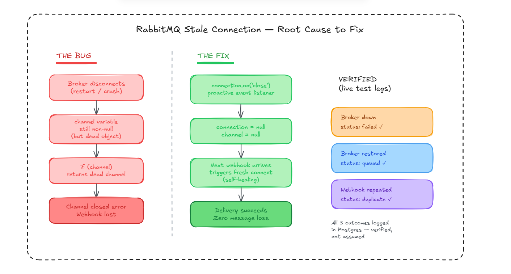

# Postmortem — RabbitMQ Stale Connection After Broker Restart

**Status:** Resolved · **Severity:** High (silent message loss) · **Component:** `packages/shared/queue/rabbitmq.ts`

---

## Architecture



---

## Summary

After a RabbitMQ broker restart, the receiver process continued throwing `IllegalOperationError: Channel closed` on every webhook — even though the broker was healthy again. Fresh webhooks failed to publish until the entire receiver process was manually restarted. Root cause: a singleton connection/channel pattern that checked for _non-null_, not _usability_.

---

## How I Found It

I was running fault-injection tests for Week 2 (`webhook_logs` three-state coverage: `queued`, `duplicate`, `failed`). Test plan was straightforward:

1. Stop the RabbitMQ Docker container
2. Send a webhook → confirm it logs `status: failed`
3. Restart the container
4. Send a fresh webhook → confirm it now logs `status: queued`

Step 4 didn't behave as predicted. The broker was back up — `docker ps` confirmed it healthy — but the webhook still failed with the exact same error as step 2: `IllegalOperationError: Channel closed`.

That mismatch was the signal. If the broker is healthy and the webhook still fails the same way, the problem isn't the broker — it's something in my own process holding onto stale state.

---

## Root Cause

The connection/channel logic used a singleton pattern to avoid creating a new TCP connection on every webhook:

```typescript
let connection: ChannelModel | null = null;
let channel: Channel | null = null;

export async function createChannel(): Promise<Channel> {
  if (channel) return channel; // <-- the bug
  const conn = await connectToRabbitMq();
  channel = await conn.createChannel();
  return channel;
}
```

`if (channel) return channel` answers one question: **"have I ever created a channel?"** It does not answer the question that actually matters: **"is this channel still alive?"**

When the broker force-closes the TCP connection (restart, crash, network blip), amqplib invalidates the channel internally — but the JavaScript variable in my process still points to that same object. Non-null, but dead. Every subsequent call returned the corpse of a channel, which threw the moment anything tried to `.publish()` on it.

---

## Why This Was Dangerous

This is the exact failure class HQRelay exists to prevent — invisible event loss with no error surfaced to the operator. The receiver kept returning `500` to the sender (correct behavior, sender would retry), but the underlying cause — a never-healing connection — would not have resolved itself. Every retry from Razorpay would have kept failing until someone manually restarted the process. In production, that's an on-call page, not a self-healing system.

---

## The Fix

amqplib exposes lifecycle events directly on the connection object. `'close'` fires exactly when the broker terminates the connection — not on unrelated errors like a malformed message or an auth failure. That specificity is what makes it the right place to reset state.

```typescript
connection.on("close", () => {
  connection = null;
  channel = null;
  console.warn("RabbitMQ connection closed.");
});
```

### Two design decisions made here, both deliberate:

**1. Proactive reset (event listener), not reactive reset (catch block).**
A catch-block reset around every `.publish()` call would fire for _any_ publish failure — wrong routing key, serialization error, auth issue — not just a dead connection. Resetting the entire singleton in response to unrelated errors is overkill and risks masking real bugs. The `'close'` event fires for exactly one reason: the broker is gone. Right signal, right place.

**2. No automatic reconnect loop.**
I considered wrapping reconnection in a `setTimeout` retry loop. Dropped it — if the broker is still down after the retry delay, the loop just throws and dies on its first attempt anyway, adding complexity without real benefit. Instead, both singleton variables reset to `null` and nothing more. The next incoming webhook naturally calls `createChannel()` again, which sees `channel === null` and builds a fresh connection from scratch. Self-healing, with no hidden timers to reason about.

---

## Verification

Three webhook_logs states tested end-to-end, with the outcome predicted _before_ running each test:

| Test                  | Broker State | Predicted                                          | Actual (Postgres-logged) |
| --------------------- | ------------ | -------------------------------------------------- | ------------------------ |
| Fresh webhook         | Down         | `status: failed`, HTTP 500                         | ✅ Matched               |
| Fresh webhook         | Restored     | `status: queued`, HTTP 202, new connection created | ✅ Matched               |
| Same webhook repeated | Healthy      | `status: duplicate`, no re-publish                 | ✅ Matched               |

All three legs verified directly in the Neon Postgres dashboard, not just inferred from logs.

---

## What I'd Still Want to Test

This fix is verified for a single broker disconnect/reconnect cycle under no concurrent load. Not yet tested:

- Concurrent webhooks arriving during the exact moment of reconnection
- Repeated rapid disconnect/reconnect cycles (flapping connection)
- Behavior under sustained broker unavailability beyond a few minutes

Naming these explicitly rather than claiming full production hardening — the fix solves the specific failure mode I found, not every theoretical one.

---

[← Back to main README](../../README.md)
