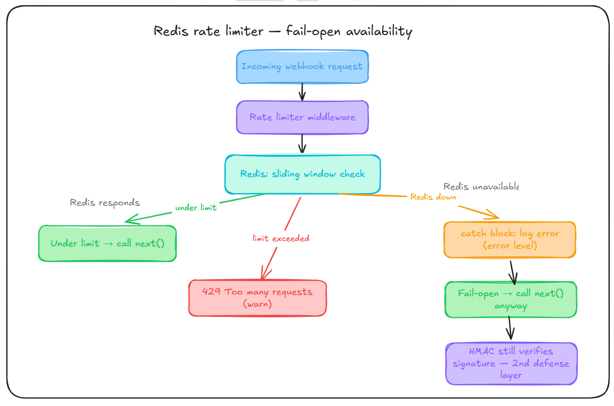

# Fail-Open Rate Limiter (Redis down → let requests through)

`apps/receiver/src/middleware/rateLimiter.ts`



---

## The problem

Rate limiter checks Redis (`ZADD`/`ZCARD`, sliding window) before allowing a request through. If Redis goes down, what happens to incoming webhooks?

Two options:

- **Fail closed** — reject everything until Redis is back.
- **Fail open** — skip the check, let requests through.

## What I picked and why

Fail open. Reasoning: rate limiting isn't the only thing protecting this endpoint — HMAC signature check runs independently and doesn't touch Redis at all. So even with rate limiting down, forged requests still get rejected. What's actually lost during a Redis outage is narrower than "no protection" — it's just "a legit sender could send too fast for a bit." That's a much smaller risk than making Redis (a secondary safety feature) a single point of failure for the whole receiver.

If I'd fail-closed instead, a random Redis blip would take down webhook ingestion entirely — for a system whose whole job is reliable delivery, that's backwards.

## Code

```typescript
try {
  const isInvalidReq = await isRateLimited(projectId);
  if (isInvalidReq) {
    req.logger?.warn({ projectId }, "429 Too many frequent request");
    return res.status(429).json({ message: "Too many frequent request" });
  }
  next();
} catch (error) {
  req.logger?.error({ err: error }, "redis service is down");
  return next(); // fail-open — HMAC still protects the endpoint
}
```

Two things I was deliberate about:

- `next()` in the catch — not a 500. Redis failing isn't the request's fault.
- `error` level here, not `warn` (which the normal 429 case uses). This is Redis being unreachable, different severity than a normal rate-limit hit — should be loud enough to eventually page someone once alerting exists.

## Not a universal rule

Idempotency checks don't fail open the same way — a missed duplicate check means double-delivering to a customer's server, which is worse than a burst of unthrottled legit traffic. Each dependency gets judged on what's actually at risk if it's skipped.

## Still want to test

- What happens under a longer Redis outage (minutes, not a blip) — does the error-log volume itself become noisy, does anything actually escalate it.
- Whether an attacker timing a spam burst to a Redis outage window is worth designing against now, or later.

---

[← Back to main README](../../readme.md)
