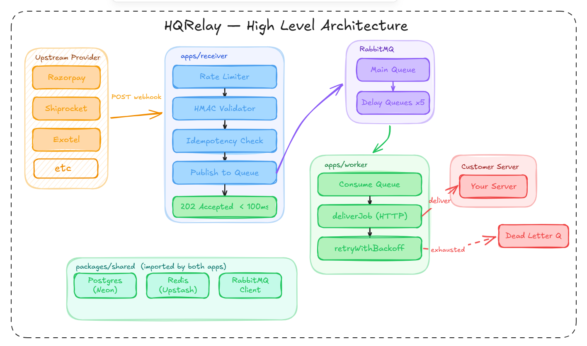

<div align="center">

# HQRelay

**Fault-tolerant webhook relay engine for Indian B2B startups**

[](https://nodejs.org)
[](https://typescriptlang.org)
[](https://rabbitmq.com)
[](https://neon.tech)
[](https://upstash.com)
[](https://docker.com)

</div>

---

## The Problem

Your startup integrates with Razorpay, Shiprocket, Exotel — maybe all three.

Each of them sends **webhooks**: HTTP POST requests fired the moment something happens. Payment captured. Order shipped. Call ended.

Here's the catch: **if your server is down when that webhook arrives, it's gone forever.**

No retry. No queue. No second chance. Razorpay tried, got no response, moved on.

```
Razorpay fires webhook at 2:00 AM
Your server is restarting (deployment)
Razorpay gets no response
Payment event = silently lost
Your customer's order = never processed
```

This is a real failure mode that real companies hit. At scale — a flash sale, a traffic spike — it gets worse.

---

## What HQRelay Does

HQRelay sits between your upstream providers (Razorpay, Shiprocket, etc.) and your own servers.

```
Razorpay ──→ HQRelay Receiver ──→ RabbitMQ Queue ──→ HQRelay Worker ──→ Your Server
               (catches it)         (holds it safe)      (delivers it)
```

Instead of firing directly at your server, providers fire at HQRelay. HQRelay:

1. **Catches** the webhook instantly — responds `202 Accepted` in under 100ms
2. **Queues** it durably in RabbitMQ — survives crashes, restarts, broker blips
3. **Delivers** it to your server with full retry logic
4. **Retries** on failure — 5s → 30s → 5min → 30min → 1hr exponential backoff
5. **Logs** every attempt to Postgres — full audit trail, forever

Your server can be down for an hour. HQRelay will keep trying. When you come back, everything delivers.

---

## Architecture Overview

> Architecture diagram will be added progressively as the system grows.

**Two independent processes. One shared brain.**



**Why two processes?** If the worker crashes (slow delivery, network hang), the receiver keeps running. Razorpay always gets its `202`. Independent failure, independent scaling.

---

## Key Design Decisions (Backend Thinking)

These are the decisions that separate a webhook forwarder from a reliable relay engine.

### 1. HMAC Signature Verification

Every incoming webhook is cryptographically verified before touching the queue.

```
Razorpay sends: X-Razorpay-Signature: <sha256 hmac>
HQRelay checks: hmac(secret, rawBody) === signature
Mismatch → 401. End of story.
```

Why rawBody? JSON parsers reorder keys. A re-stringified body produces a different HMAC. We capture the raw bytes before Express touches them.

### 2. Idempotency (No Double Delivery)

Providers retry webhooks. Razorpay will fire the same payment event 3 times if you're slow to respond. Without idempotency, you'd process the same payment 3 times.

```
X-Webhook-Id: <provider-supplied UUID>
                    ↓
Redis key: hqrelay:idempotency:<webhookId>  (24hr TTL)
                    ↓
Already seen? → 202 (acknowledged, not re-queued)
First time?   → queue + mark seen
```

Write ordering matters: publish to RabbitMQ first, mark Redis second. Reversed order = crash between writes = event lost permanently.

### 3. Redis Sliding Window Rate Limiter

Fixed-window rate limiting has a known attack: send 2× your limit in 2 seconds by straddling a window reset. Sliding window closes this.

```
Redis Sorted Set per projectId
Score = timestamp (ms)
On each request:
  1. Remove entries older than 60s
  2. Count remaining
  3. If count ≥ 100 → 429
  4. Add new entry
  5. Set 60s expiry
```

Rate limit is per `projectId`, not per IP. Razorpay sends webhooks for all your customers from one IP — per-IP rate limiting would block everyone at once.

On Redis outage: **fail open** (let the request through). HMAC validation still runs. A webhook relay's job is availability. Briefly unenforced rate limits beat dropping real payment events.

### 4. Project Config Caching (Cache-Aside)

HMAC verification needs the project's secret. Hitting Postgres on every webhook (10–50ms round-trip) is the bottleneck at scale.

```
Check Redis first  → hqrelay:projectConfig:<projectId>  (5min TTL)
Cache hit  → use it, skip DB
Cache miss → query Postgres, populate Redis, proceed
```

5-minute TTL is deliberate. Too long (24hr) means a rotated secret causes valid webhooks to fail for hours.

### 5. Exponential Backoff via Delay Queues

No `setTimeout` in the worker. Sleeping blocks the process. Instead, 5 dedicated delay queues with RabbitMQ TTL:

```
delay.5s   → TTL 5s   → DLX → main queue (re-consumed)
delay.30s  → TTL 30s  → DLX → main queue
delay.5min → TTL 5min → DLX → main queue
...
```

Worker stays free the entire wait period. Horizontally scalable — add more workers, they all consume from the same queue.

### 6. Full Audit Trail in Postgres

Every delivery attempt logged: `status_code`, `latency_ms`, `attempt_num`, `status` (delivered / failed / dead_lettered). Separate `webhook_logs` table tracks the receiver side (queued / duplicate / failed-to-queue). Answer "what happened to this payment webhook at 2 AM" in one SQL query.

---

## Tech Stack

<table>
  <tr>
    <td align="center" width="130">
      <br/>
      <b>Node.js 20</b><br/>
      <sub>Runtime</sub>
    </td>
    <td align="center" width="130">
      <br/>
      <b>TypeScript</b><br/>
      <sub>Language</sub>
    </td>
    <td align="center" width="130">
      <br/>
      <b>Express.js</b><br/>
      <sub>Web Framework</sub>
    </td>
    <td align="center" width="130">
      <br/>
      <b>RabbitMQ</b><br/>
      <sub>Message Queue</sub>
    </td>
    <td align="center" width="130">
      <br/>
      <b>PostgreSQL</b><br/>
      <sub>Database (Neon)</sub>
    </td>
  </tr>
  <tr>
    <td align="center" width="130">
      <br/>
      <b>Redis</b><br/>
      <sub>Cache (Upstash)</sub>
    </td>
    <td align="center" width="130">
      <br/>
      <b>Docker</b><br/>
      <sub>Containerization</sub>
    </td>
    <td align="center" width="130">
      <br/>
      <b>AWS EC2</b><br/>
      <sub>Deployment</sub>
    </td>
    <td align="center" width="130">
      <br/>
      <b>GitHub Actions</b><br/>
      <sub>CI/CD</sub>
    </td>
    <td align="center" width="130">
      <br/>
      <b>Nginx</b><br/>
      <sub>Reverse Proxy</sub>
    </td>
  </tr>
</table>

> **Also uses:** Drizzle ORM (type-safe schema-as-code), ioredis (persistent TCP client), Prometheus + Grafana (observability — Week 3)

---

## Project Structure

```
hqrelay/
├── apps/
│   ├── receiver/                  ← Accepts webhooks, queues them
│   │   └── src/
│   │       ├── index.ts           ← Express entrypoint (dotenv FIRST)
│   │       ├── routes/            ← URL + method only
│   │       ├── controllers/       ← Request/response only
│   │       ├── services/          ← Business logic (queueWebhook)
│   │       └── middleware/        ← rateLimiter, hmacValidator
│   │
│   └── worker/                    ← Delivers webhooks, handles retries
│       └── src/
│           ├── index.ts
│           ├── consumeQueue.ts    ← RabbitMQ consumer, ack/nack logic
│           ├── deliverJob.ts      ← HTTP delivery, returns typed result
│           └── retryWithBackoff.ts ← Routes to delay queue by attempt
│
└── packages/
    └── shared/                    ← Imported by both apps
        └── src/
            ├── db/                ← Drizzle client, schema, migrations
            ├── cache/             ← Redis client, idempotency, rate limiter
            ├── queue/             ← RabbitMQ connection, publish
            └── repositories/     ← DB access layer (projects, endpoints, delivery)
```

**Conventions enforced:**

- `dotenv.config()` is always the first line of every entrypoint
- Repository layer = DB access only, zero business logic
- UUID primary keys everywhere
- `ON DELETE RESTRICT` on all audit-trail foreign keys
- pgEnum for all fixed-set status fields
- Redis namespace prefix `hqrelay:` on every key to prevent collisions

---

## API

### Receive a Webhook

```
POST /v1/webhooks/:projectId
```

**Headers required:**

```
Content-Type: application/json
X-Hub-Signature-256: sha256=<hmac_signature>
X-Webhook-Id: <idempotency_key>         (optional — sha256 fallback if absent)
```

**Response:**

```
202 Accepted   → queued for delivery
400            → missing projectId or malformed request
401            → invalid HMAC signature or unknown project
429            → rate limit exceeded (100 req/min per project)
500            → internal error (RabbitMQ down, DB unreachable)
```

Responds in under 100ms. Delivery happens asynchronously.

### Health Check

```
GET /health
→ 200 { status: "ok" }
```

---

## Getting Started (Local)

**Prerequisites:** Node.js 20+, Docker, npm

```bash
# Clone
git clone https://github.com/Arunkoo/hqrelay.git
cd hqrelay

# Install all workspace dependencies
npm install

# Start RabbitMQ
docker compose up -d

# Copy and fill environment variables
cp apps/receiver/.env.example apps/receiver/.env
cp apps/worker/.env.example apps/worker/.env
```

**Required environment variables:**

```env
# Postgres (Neon)
DATABASE_URL=postgresql://...

# Redis (Upstash)
REDIS_URL=rediss://...

# RabbitMQ
RABBITMQ_URL=amqp://localhost:5672
```

```bash
# Run migrations
cd packages/shared
npx drizzle-kit migrate

# Start receiver (terminal 1)
cd apps/receiver
npm run dev

# Start worker (terminal 2)
cd apps/worker
npm run dev
```

Receiver runs on `http://localhost:3000`. RabbitMQ management UI at `http://localhost:15672`.

---

## Database Schema

```
projects          → one row per customer (stores HMAC secret)
    │
    └── endpoints → one row per target URL per project
            │
            └── delivery_attempts → one row per delivery attempt
                                    (status_code, latency_ms, attempt_num)

webhook_logs      → receiver-side log (queued / duplicate / failed-to-queue)
                    logged before RabbitMQ, separate from delivery_attempts
```

`delivery_attempts` and `webhook_logs` are append-only. No deletes, no updates. Complete history of every event from the moment it arrived.

---

## Reliability Guarantees

| Scenario                             | Behavior                                                     |
| ------------------------------------ | ------------------------------------------------------------ |
| Customer server is down              | Retries for up to ~2 hours (5 attempts, exponential backoff) |
| HQRelay receiver crashes mid-request | RabbitMQ message unacked → requeued automatically            |
| RabbitMQ restarts                    | Durable queues + persistent messages → nothing lost          |
| Duplicate webhook from provider      | Idempotency check → acknowledged, not re-queued              |
| Redis goes down                      | Rate limiter fails open; HMAC still validates all requests   |
| Unknown project ID                   | 401 (not 404 — avoids leaking internal ID structure)         |
| Webhook exhausts all retries         | Moves to dead-letter queue (consumer + alert — roadmap)      |

---

## Roadmap

### Week 3 — Observability (In Progress)

- [ ] Pino structured logging with correlation IDs end-to-end
- [ ] Prometheus `/metrics` on receiver + worker
- [ ] Grafana dashboard (queue depth, delivery rate, retry rate, latency)
- [ ] Deep health check endpoints
- [ ] Nginx reverse proxy with SSL
- [ ] GitHub Actions CI/CD → AWS EC2
- [ ] All services in Docker Compose

### Week 4 — AI Layer + Portfolio Polish

- [ ] `GET /v1/dashboard/insights/:projectId` — Claude API analyzes failure patterns, surfaces anomalies in plain English
- [ ] Postman collection (all endpoints, example payloads)
- [ ] k6 load test — 1000 req/sec sustained
- [ ] Architecture diagram
- [ ] EC2 deployment live

### v2 Features (Post-MVP)

- [ ] Transactional Outbox Pattern — atomic dual-write (Postgres + RabbitMQ)
- [ ] Dead-letter consumer + customer alert (email / webhook callback)
- [ ] Multi-endpoint routing by event type (`payment.*` → endpoint A, `order.*` → endpoint B)
- [ ] Tiered rate limits (100/min default, 1000/min enterprise)
- [ ] Customer dashboard (delivery status, retry history, failure alerts)

---

## What I Learned Building This

This project was designed to demonstrate production backend thinking, not just working code. Some decisions that required real reasoning:

**On distributed systems:** Two separate writes (Postgres log + RabbitMQ publish) can't be made atomic without a transaction coordinator. The current approach uses idempotency + at-least-once delivery as a pragmatic MVP alternative. The Transactional Outbox Pattern is the correct v2 solution.

**On failure modes:** Every design decision was made by asking "what happens when this fails?" not "what happens when this works?" — Redis outage, broker restart, crashed process, duplicate provider retry. Each scenario has an explicit answer.

**On separation of concerns:** The receiver's only job is to respond in under 100ms. The worker's job is reliability. They share nothing at runtime except a message queue — this is why they're separate processes, not just separate files.

---

## Author

**Arun** — Backend Engineering (Fresher)

Building real infrastructure to demonstrate production thinking.

[GitHub](https://github.com/Arunkoo) · [LinkedIn](https://www.linkedin.com/in/arun-kumar-948a392a9/) 

---

<div align="center">
<sub>HQRelay — Built to show what backend engineering actually looks like.</sub>
</div>
